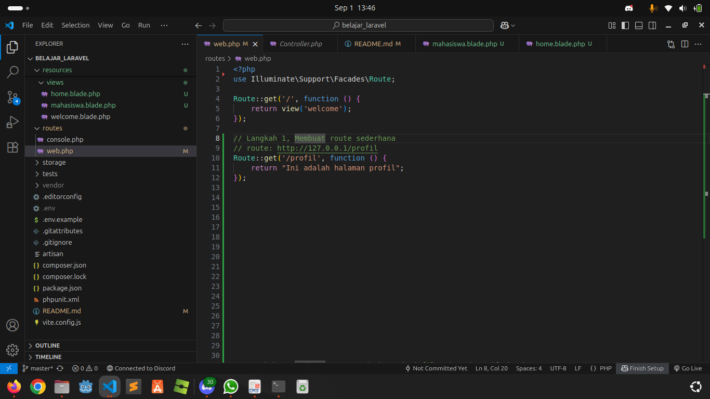
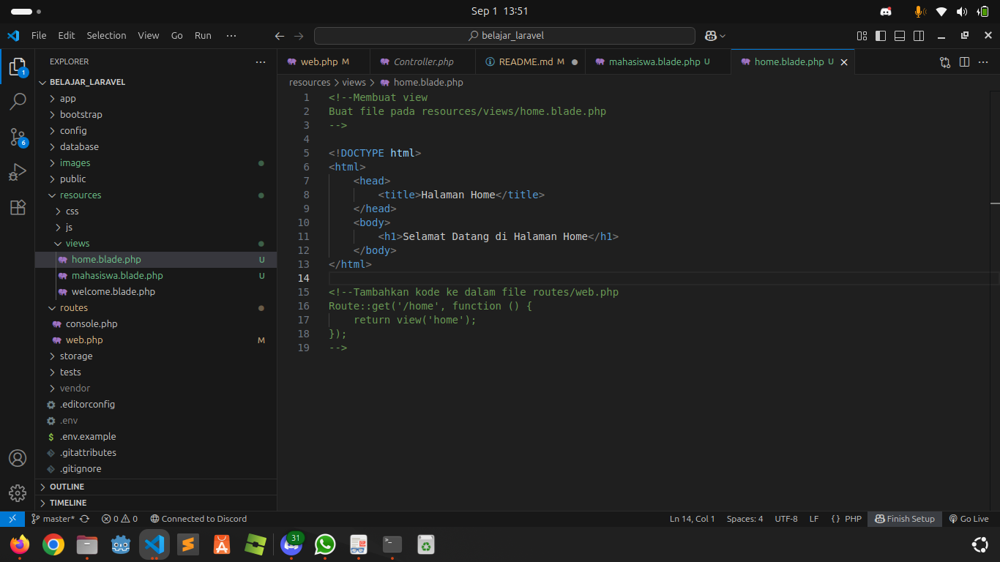
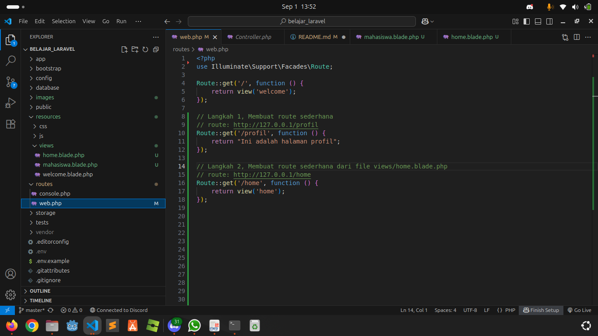
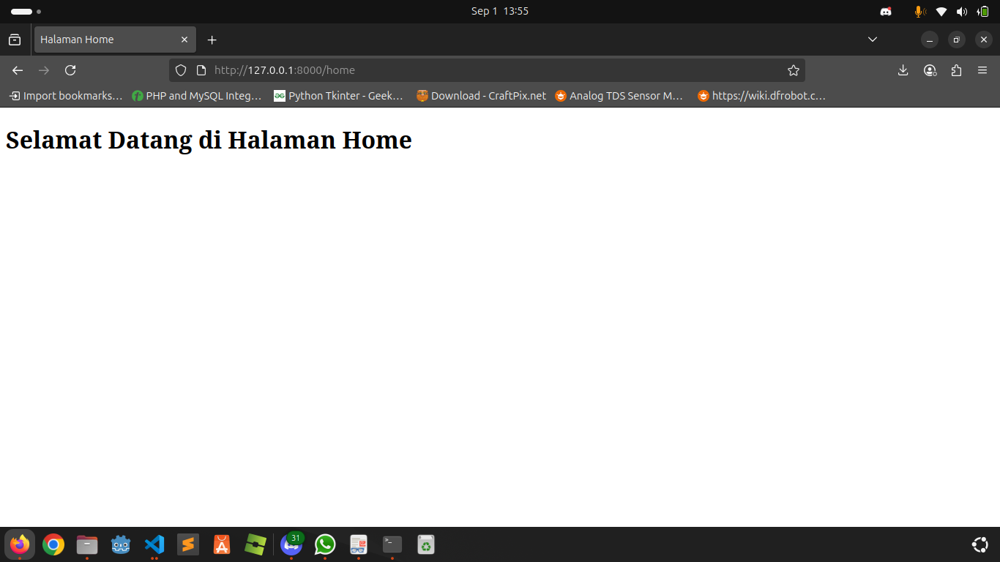
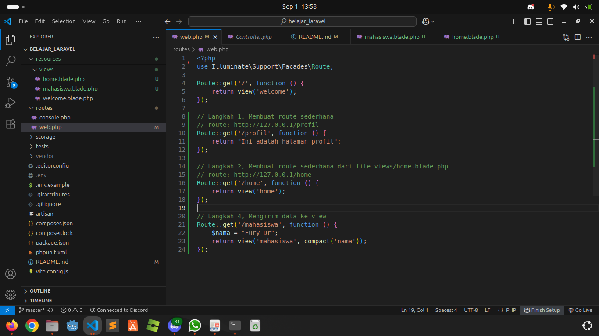
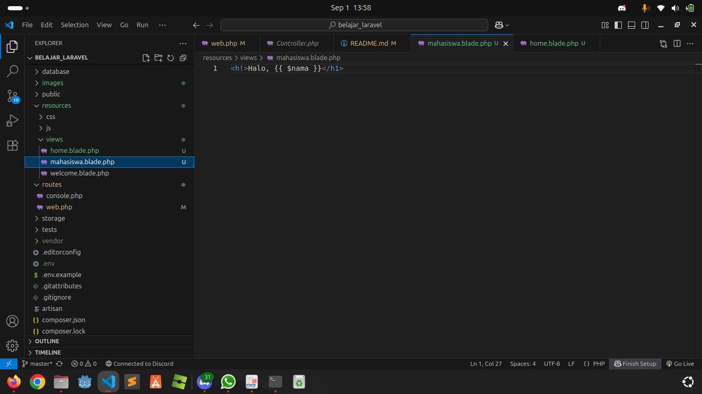
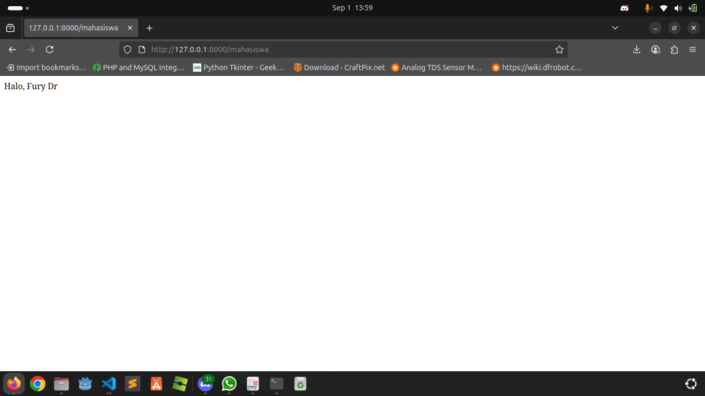

## Langkah 2, Membuat Route Sederhana
Edit file `routes/web.php`
```php
Route::get('/', function () {
    return "Selamat Datang di Laravel!";
});

Route::get('/profil', function () {
    return "Ini adalah halaman profil";
});
```
Coba akses : http://localhost:8000/profil



## Langkah 3, Membuat View
Buat file `resources/views/home.blade.php`
```html
<!DOCTYPE html>
    <html>
        <head>
            <title>Halaman Home</title>
        </head>
        <body>
            <h1>Selamat Datang di Halaman Home</h1>
        </body>
</html>
```
Tambahkan route :
```php
Route::get('/home', function () {
    return view('home');
});
```
Coba akses : http://localhost:8000/home




## Langkah 4, Mengirim Data ke View
Buat route dengan data :
```php
Route::get('/mahasiswa', function () {
    $nama = "Fury Dr";
    return view('mahasiswa', compact('nama'));
});
```
Buat file `resources/views/mahasiswa.blade.php`
```html
<h1>Halo, {{ $nama }}</h1>
```
Coba akses : http://localhost:8000/mahasiswa



